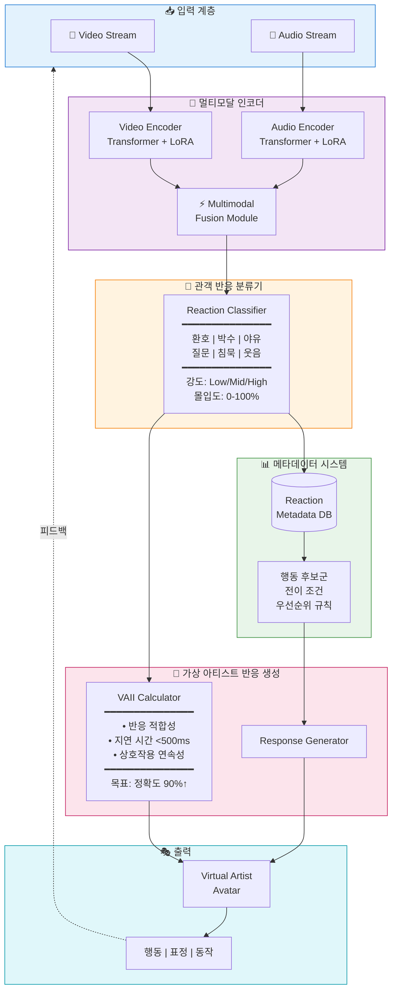

# 가상 아티스트-관객 상호작용 시스템 아키텍처

```mermaid
flowchart TB
    subgraph INPUT["📥 입력 계층"]
        CAM["🎥 Video Stream"]
        MIC["🎤 Audio Stream"]
    end

    subgraph ENCODER["🔄 멀티모달 인코더"]
        VE["Video Encoder<br/>Transformer + LoRA"]
        AE["Audio Encoder<br/>Transformer + LoRA"]
        FUSION["⚡ Multimodal<br/>Fusion Module"]
    end

    subgraph CLASSIFIER["🎯 관객 반응 분류기"]
        RC["Reaction Classifier<br/>━━━━━━━━━━━━━━━<br/>환호 | 박수 | 야유<br/>질문 | 침묵 | 웃음<br/>━━━━━━━━━━━━━━━<br/>강도: Low/Mid/High<br/>몰입도: 0-100%"]
    end

    subgraph METADATA["📊 메타데이터 시스템"]
        MDB[("Reaction<br/>Metadata DB")]
        RULES["행동 후보군<br/>전이 조건<br/>우선순위 규칙"]
    end

    subgraph RESPONSE["🤖 가상 아티스트 반응 생성"]
        RG["Response Generator"]
        VAII["VAII Calculator<br/>━━━━━━━━━━━━━━━<br/>• 반응 적합성<br/>• 지연 시간 <500ms<br/>• 상호작용 연속성<br/>━━━━━━━━━━━━━━━<br/>목표: 정확도 90%↑"]
    end

    subgraph OUTPUT["🎭 출력"]
        VA["Virtual Artist<br/>Avatar"]
        BEM["행동 | 표정 | 동작"]
    end

    CAM --> VE
    MIC --> AE
    VE --> FUSION
    AE --> FUSION
    FUSION --> RC
    RC --> MDB
    MDB --> RULES
    RULES --> RG
    RC --> VAII
    RG --> VA
    VAII --> VA
    VA --> BEM
    BEM -.->|피드백| INPUT

    style INPUT fill:#e3f2fd,stroke:#1976d2
    style ENCODER fill:#f3e5f5,stroke:#7b1fa2
    style CLASSIFIER fill:#fff3e0,stroke:#f57c00
    style METADATA fill:#e8f5e9,stroke:#388e3c
    style RESPONSE fill:#fce4ec,stroke:#c2185b
    style OUTPUT fill:#e0f7fa,stroke:#0097a7
```
